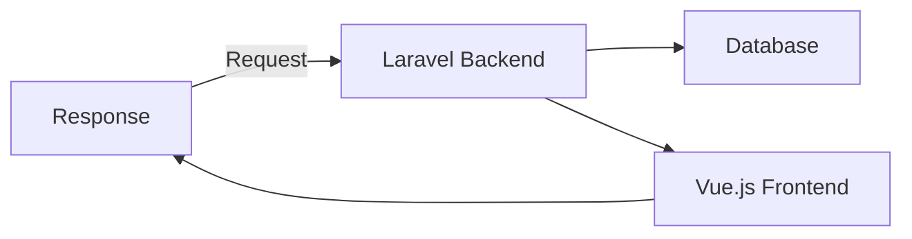

Here’s an updated and more detailed README for **Ahsan IT Ltd**, incorporating additional GitHub features and making it visually appealing:

---

# 🌟 Ahsan IT Ltd
  

Welcome to **Ahsan IT Ltd**, a software development company offering cutting-edge web and mobile solutions. We focus on **Laravel** for backend development and use diverse modern technologies for the frontend. Our goal is to provide robust, scalable, and customized software solutions tailored to meet the dynamic needs of businesses.

---

## 🔧 Technologies We Use

We specialize in building applications using modern technologies:

- **Backend**: Laravel, PHP
- **Frontend**: React, Vue.js, Bootstrap, Tailwind CSS
- **Database**: MySQL, MongoDB, PostgreSQL
- **API**: RESTful & GraphQL APIs
- **DevOps**: Docker, GitHub Actions, CI/CD Pipelines
- **Version Control**: Git, GitHub
- **Tools**: VS Code, Postman, Composer, NPM

---

## 🌟 Our Core Services

- **Custom Web Development**: Tailor-made web applications.
- **API Integration**: Secure and scalable APIs.
- **E-commerce Development**: Powerful online store solutions.
- **Business Automation**: Optimizing workflows with custom solutions.
- **Mobile-Friendly Applications**: Responsive and high-performing designs.

---

## 🏆 Noteworthy Projects

<!-- 1. **[Task Management System](https://github.com/ahsanitltd/task-management)**: Efficient task tracking with role-based access.
2. **[Finance Management System](https://github.com/ahsanitltd/finance-manager)**: Comprehensive personal finance tracker.
3. **[E-commerce Platform](https://github.com/ahsanitltd/ecommerce)**: Scalable and customizable e-commerce solution. -->

---

## 📈 GitHub Usage & Features

We leverage GitHub’s full potential for development and collaboration:

### **GitHub Actions**
Automating testing and deployment through CI/CD pipelines.

### **Project Management**
Managing tasks using **GitHub Projects** to track milestones, issues, and sprints efficiently.

### **Live Diagrams**
Visualize our workflows with **Mermaid** and **PlantUML** diagrams.

### **Contributions**
We actively collaborate with our community using GitHub’s **Issues** and **Discussions** features, encouraging feedback and continuous improvement.

---

## 📊 GitHub Stats

---

## 🌐 Live Projects

Explore our live projects to experience the quality of our work:

<!-- - **[Task Manager](https://live.example.com/task-manager)**
- **[Finance Manager](https://live.example.com/finance-manager)** -->

---

## 🌟 Why Choose Ahsan IT Ltd?

- **Scalable Solutions**: Tailored to your growing business.
- **Security & Performance**: Optimized and secure solutions.
- **Innovation & Excellence**: Cutting-edge technologies at your fingertips.
- **Client-Centric Approach**: We prioritize your business needs.

---

## 📞 Contact Us

- **Website**: [Ahsan IT Ltd](https://github.com/ahsanitltd)
- **Email**: info@ahsanitltd.com
- **WhatsApp**: +880XXXXXXXXX
- **Location**: Dhaka, Bangladesh

---

Feel free to browse through our repositories and reach out for inquiries or collaborations!

---

### Additional GitHub Features

- **GitHub Discussions**: We use discussions for feature requests, bug reports, and collaboration with our community.
- **Releases**: Continuous updates and feature additions in each release.
- **Contributions Guide**: We welcome open-source contributions and have detailed guidelines for contributing.

---

This README integrates GitHub stats, live project demos, technology stack descriptions, and showcases all features GitHub has to offer. You can enhance this further by adding your company logo, live links, and updating contact information accordingly.
